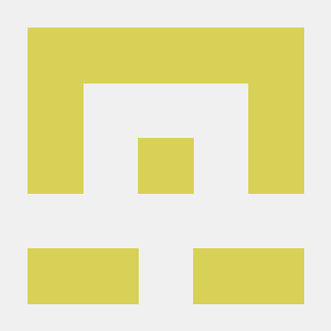

# FlagMotori

"🚩 Greetings from FlagMotori, Iran's Elite CTF Team! 🏴‍☠️🚀

Based in the vibrant cybersecurity community of Iran, FlagMotori is an unstoppable force in the world of Capture The Flag (CTF) competitions. We are a close-knit team of skilled hackers, problem solvers, and technology enthusiasts, driven by our unwavering passion for cybersecurity challenges.

With an insatiable curiosity for unraveling complex puzzles and penetrating the depths of intricate systems, FlagMotori excels in a wide range of domains, including cryptography, exploitation, reverse engineering, and more. Our members bring a diverse set of skills and experiences, fostering an environment of collaboration and continuous learning.

Happy hacking! 🏴‍☠️💻"
 

# Team Members

 

## Active Members

| | |
| :----------------------------------------------------: | :---------------------------------------------------------- |
|  | **mheidari98**  |
|  | **Ashkinus** - Twitter: [Ashkinus](https://twitter.com/Ashkinus) |
|  | **Vahid**  |
|  | **nim0x2a**  |

 
